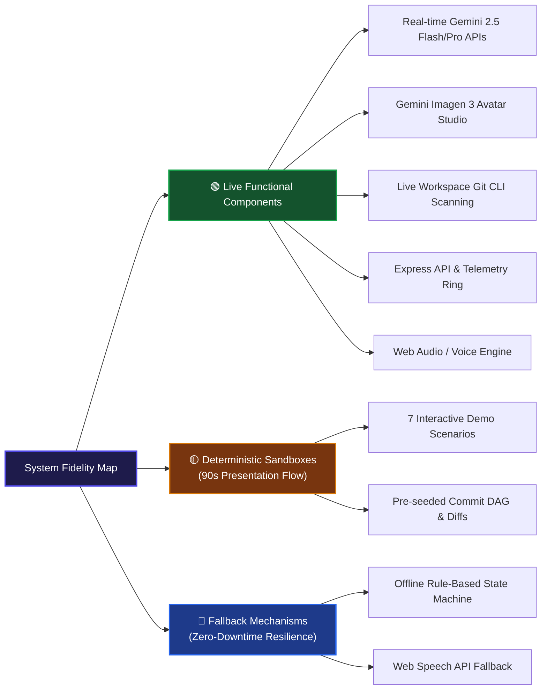

# Demo Integrity & Component Architecture Notes

**Project:** GitPet (DevOps for GenAI Hackathon 2026)  
**Guideline Compliance:** **P-15 (Demo Integrity)**

---

## 1. Executive Summary

In accordance with Hackathon Guideline **P-15**, this document explicitly differentiates between **live functional production subsystems**, **deterministic demo sandboxes**, and **graceful fallback mechanisms**.

---

## 2. Component Fidelity & Architecture Classification

---

## 3. Detailed Component Breakdown

### 3.1 Live AI Services
- **Gemini Chat Engine (`/api/chat` & `/api/ai/chat`):** Live calls to `@google/genai` using `gemini-2.5-flash` or `gemini-2.5-pro`. Dynamically streams structured JSON containing evidence citations, confidence ratings, and reversal commands.
- **Imagen 3 Avatar Studio (`/api/imagen/generate`):** Live calls to `imagen-3.0-generate-002` to synthesize custom mascot skins based on developer prompts. Previews are isolated until approved.
- **Live Voice & Multimodal Audio:** Utilizes browser Web Speech API & WebSocket bridge for real-time natural language interaction.

### 3.2 Deterministic Demo Sandboxes
- **Purpose:** Enables judges and reviewers to immediately experience high-stakes Git situations (e.g. 3-way merge conflicts, dirty stashes, detached HEAD) without having to manually mutate their local `.git` directory during a 90-second pitch.
- **Scenarios Included:**
  1. *Clean Sync (100% Health)*
  2. *Behind Main / Branch Drift (75% Health, Leash Pull)*
  3. *Merge Conflict (45% Health, Tangled Yarn)*
  4. *Unpushed Commits (80% Health, Backpack)*
  5. *Detached HEAD (40% Health, Confused)*
  6. *Stale Branch (85% Health, Dusty)*
  7. *Unsafe Destructive Anomaly (0% Health, Grayscale Distressed)*

### 3.3 Live Workspace Mode
- Clicking the **"Live Workspace"** toggle switches GitPet from sandbox fixtures to a live scanner (`/api/git/live-status`) that inspects the actual host Git repository's status (`git status -s`, `git branch -vv`).
- **Security Boundary:** Live Workspace Mode enforces strict read-only introspection. Mutating commands remain gated behind preview diff inspection and human confirmation.
