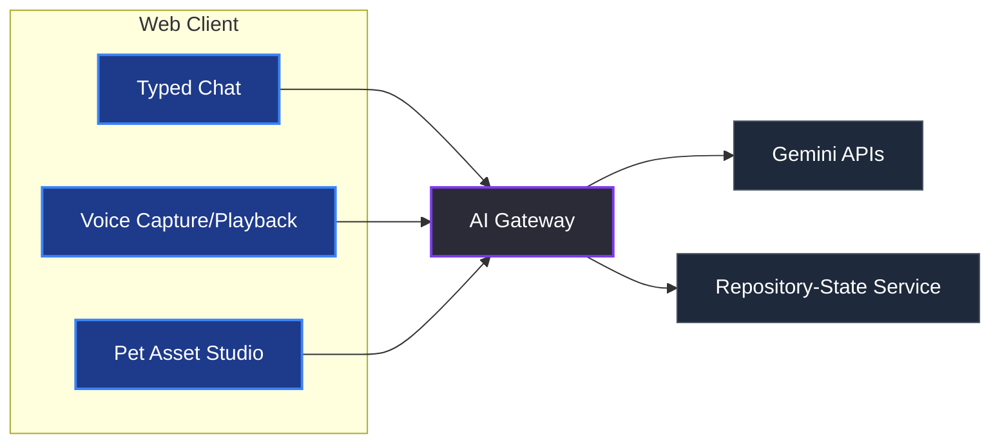

# Functional Specification Document: GitPet

## Functional specification: GitPet

Repository work often hides context across branches, remotes, and local changes. GitPet makes that state visible without a terminal-first investigation.

GitPet is a repository management companion with ambient awareness. It maps repository signals to an expressive pet state. It explains issues clearly and proposes one safe Git action for approval.

GitPet follows a simple repository loop:

1. **Notice:** The pet makes repository health visible at a glance.
2. **Understand:** The developer receives an evidence-based explanation in plain language.
3. **Resolve:** The developer approves a bounded, reversible repository action.

### Product objectives

* **At-a-glance repository status:** Surface healthy, attention, and blocked states through posture, mood, and color.
* **Lower cognitive load:** Explain branch divergence, conflicts, and uncommitted work in plain language.
* **Human-approved actions:** Require confirmation for every write operation.
* **Explainable recommendations:** Show repository evidence, expected impact, and reversal steps.
* **Safer Git habits:** Reward review, clean handoffs, and verified repository state.
* **Multimodal assistance:** Support typed and voice repository questions through Gemini.
* **Expressive pet assets:** Generate and refine pet visuals without changing repository state.

### Core mechanics and state machine

#### Health and emotional state mapping

The pet state combines **Repository Health** and **Repository Symptom**. Health conveys urgency. Symptoms identify the repository condition.

| **Health** | **Health %** | **Visual treatment**         | **Operator meaning**                        |
| ---------- | ------------ | ---------------------------- | ------------------------------------------- |
| Healthy    | 90–100%      | Relaxed, playful, green glow | Branch is synchronized and clean            |
| Attention  | 60–89%       | Uneasy, amber pulse          | Review local or remote differences          |
| Blocked    | 1–59%        | Distressed, red pulse        | Resolve a conflict or protect work          |
| Unsafe     | 0%           | Still, grayscale             | Action could lose work without intervention |

| **Symptom**    | **Pet expression**  | **Repository signal**                     |
| -------------- | ------------------- | ----------------------------------------- |
| Behind remote  | Pulling on a leash  | Local branch is behind its upstream       |
| Unpushed work  | Carrying a backpack | Commits or changes exist only locally     |
| Merge conflict | Tangled yarn        | Conflicting files block a merge or rebase |
| Stale branch   | Sleepy and dusty    | Branch is merged or inactive              |
| Detached HEAD  | Looking lost        | HEAD does not point to a named branch     |

#### Repository practice

Practice mechanics reward safe repository work, not fast clicks. They remain secondary to the task at hand.

* **Change review:** Award a Clean Commit streak when the developer reviews a proposed diff.
* **Verified sync:** Award progress after branch status is confirmed clean and synchronized.
* **Safe handoff:** Award Branch Stewardy for merging or archiving a branch with clear context.

### End-to-end experience

```
  [ Healthy Pet ]  --->  ( Repository Changes )  --->  [ Pet Signals a Symptom ]
         ^                                                       |
         |                                                       v
  [ Verified Repository ] <--- ( Developer Approves ) <--- [ Evidence-Based Guidance ]
```

#### 1. Idle repository awareness

* The developer keeps GitPet open beside their editor or terminal.
* The pet idles while the active branch is clean and synchronized.
* A compact top bar displays repository, branch, sync status, and Clean Commit streak.

#### 2. Repository change and emotional shift

* A repository event occurs, such as remote commits, uncommitted changes, or a merge conflict.
* The health bar changes, ambient accents shift, and the pet adopts a matching expression.

#### 3. Conversational repository guidance

* The developer opens the chat: _"What needs attention?"_ or _"Status report!"_
* The developer may ask the same question by voice.
* The assistant reads structured repository metadata and responds with supporting signals:

> _"`feature/cart` is three commits behind `origin/feature/cart`. You also have two uncommitted files. Save or stash those changes before pulling."_

#### 4. Safe action and approval gate

* The assistant generates one concrete, bounded repository action:

> **Recommended action:** Stash local changes, then pull from `origin/feature/cart`.
>
> **Confidence:** High
>
> **Expected result:** Preserve local work and synchronize the branch.
>
> **Reversal:** Restore the stash after the pull.

* The UI shows evidence, confidence, expected impact, and reversal before the action card.
* The UI renders a **Preview changes** view before approval.
* The developer can inspect affected files, commits, and branch movement.
* The UI renders an interactive **Confirm & tidy** action card in the chat stream.
* The pet recovers only after repository status is rechecked.
* The UI then shows a concise repository summary and verified state.

#### 5. Voice conversation

* The developer selects the microphone control in the chat composer.
* The client requests microphone permission only after that interaction.
* The app streams audio to the voice service and shows a live transcript.
* Gemini receives the transcript and the same read-only repository context as typed chat.
* The assistant returns displayed text and optional synthesized speech.
* The developer can interrupt speech, edit the transcript, or switch to typed chat.
* Every repository write still requires the existing preview and confirmation flow.

#### 6. Pet image creation and editing

* The developer selects **Create pet** or **Edit pet** from pet customization.
* Creation accepts a short prompt, visual style, and emotion set.
* Editing accepts a selected pet asset and an instruction such as _"add a raincoat"_.
* The image service returns a preview only. It never accesses repository content.
* The developer accepts, retries, or discards each generated asset.
* Accepted assets map to existing health and symptom states.

### Live demo scenarios

The hackathon MVP perfects one deterministic scenario: a branch synchronization conflict. It demonstrates the complete notice-understand-resolve loop in under 90 seconds.

| Scenario         | MVP status    | GitPet guidance           | Target action    |
| ---------------- | ------------- | ------------------------- | ---------------- |
| Behind + changes | Full demo     | Protect local work first  | Stash, then pull |
| Merge conflict   | Scenario card | Resolve two changed files | Open diff        |
| Stale branch     | Scenario card | Branch is already merged  | Archive branch   |

#### MVP scenario: Remote updates with local work

* **Repository profile:** The remote branch gains three commits. Two local files remain uncommitted.
* **Pet emotion:** Carrying an overfilled backpack and pulling toward the remote.
* **GitPet explanation:** _"`feature/cart` is behind by three commits. Your local edits are not committed. Stash them before pulling to avoid mixing unfinished work with incoming changes."_
* **Proposed action:** Stash local changes, then pull remote commits.
* **Verification:** The branch matches its upstream and the local work remains recoverable.

#### Demo sequence

1. Show the calm pet and a clean, synchronized branch.
2. Trigger remote commits and local edits. Show the visual shift.
3. Ask for a status report. Review the evidence-backed recommendation.
4. Preview and approve the safe action. Verify synchronization and preserved work.

### UI and visual design

The UI uses a minimalist, flat-modern style that avoids visual noise.

#### Color palette

* **Canvas:** Slate Light (`#F8FAFC`) or Off-White (`#FAF9F7`).
* **Cards:** Pure White (`#FFFFFF`) with subtle borders (`#E2E8F0`).
* **Primary accents:** Repository Blue (`#2563EB`) and Sync Green (`#10B981`).
* **Attention accents:** Amber (`#F59E0B`) and Conflict Crimson (`#EF4444`).

#### Layout

* **Top bar:** Pet name, repository, current branch, and status chip.
* **Center canvas:** The pet stage, symptom expression, and health aura.
* **Bottom section:** A streamlined chat stream with evidence and approval cards.
* **Repository drawer:** Branch, commit, and working-tree details.

### Team sprint plan

```
[ Track A: UI & Visuals ] ----> Component Library ----> Canvas & Pet Animation ----+
                                                                                  |
[ Track B: AI & Tools ]   ----> Prompt Engineering  --> Git Action Engine     -----+---> [ Integration &
                                                                                  |       Demo Rehearsal ]
[ Track C: State Engine ] ----> Mock Repository API --> State Transitions     ----+
                                                                                  |
[ Track D: Narrative ]    ----> Pitch Deck Design   --> Mock Repository Data  ----+
```

* **Role 1 — Frontend and visual experience**
  * Build the main canvas, responsive layout, animated pet container, and chat log.
  * Implement ambient styling transitions from backend state.
* **Role 2 — Prompt engineering and LLM routing**
  * Construct a persona prompt that cites repository evidence and confidence.
  * Integrate Gemini text responses and enforce structured action proposals.
  * Wire approved repository actions to the mock state engine.
* **Role 3 — State machine and REST engine**
  * Build a lightweight repository-state service for status, scenarios, and actions.
  * Implement branch divergence, local edits, and post-action verification.
* **Role 4 — Scenario content and pitch strategy**
  * Write realistic branch-divergence data and an evidence narrative.
  * Create a five-slide pitch deck and rehearse the 90-second demo.

### AI integration specification

#### Architecture

The client never calls Gemini with a permanent API key. A server-side AI gateway owns credentials, rate limits, audit records, and request validation.



The repository-state service is the only source of Git facts. The gateway passes an allowlisted context object to Gemini. It never passes shell access, repository files, credentials, or unrestricted tool access.

#### Gemini chatbot

| Area             | Requirement                                                                                                              |
| ---------------- | ------------------------------------------------------------------------------------------------------------------------ |
| Model capability | Use a Gemini text model that supports structured JSON output and function calling.                                       |
| Input            | Chat message, selected repository, branch, health, symptoms, divergence, changed-file count, and approved scenario data. |
| Output           | Return `summary`, `evidence`, `recommendedAction`, `confidence`, `expectedImpact`, and `reversal`.                       |
| Tool boundary    | Expose read-only repository-status tools. Expose action preparation only after user approval.                            |
| Grounding        | Every recommendation cites values from the supplied repository context.                                                  |
| Failure behavior | Show a retryable chat error. Preserve the user message and repository snapshot.                                          |

The gateway validates every model response against the action schema. Invalid, missing, or unsupported actions become explanation-only responses.

```json
{
  "summary": "Your branch is three commits behind its upstream.",
  "evidence": ["behindCount: 3", "uncommittedFiles: 2"],
  "recommendedAction": "stash_then_pull",
  "confidence": "high",
  "expectedImpact": "Preserves local changes and synchronizes the branch.",
  "reversal": "Restore the created stash after pulling."
}
```

#### Voice conversations

| Area          | Requirement                                                                                                                        |
| ------------- | ---------------------------------------------------------------------------------------------------------------------------------- |
| Transport     | Use Gemini Live API for low-latency bidirectional audio. Use the gateway for session creation and short-lived session credentials. |
| Input control | Start capture only after a microphone interaction. Provide stop, mute, and transcript editing controls.                            |
| Context       | Send the same sanitized repository snapshot used by typed chat.                                                                    |
| Output        | Render each transcript turn. Stream voice only when the developer enables spoken replies.                                          |
| Interruption  | Stop playback and cancel the active response when the developer speaks or presses stop.                                            |
| Fallback      | If live audio is unavailable, submit the final transcript as a standard Gemini chat request.                                       |

Do not persist raw audio for the MVP. Keep transcripts only in the active session unless the developer explicitly saves chat history.

#### Image creation and editing

| Area             | Requirement                                                                                                  |
| ---------------- | ------------------------------------------------------------------------------------------------------------ |
| Model capability | Use a Gemini image-generation and image-editing model through the gateway.                                   |
| Create flow      | Submit prompt, selected style, transparent-background preference, and target emotional state.                |
| Edit flow        | Submit the approved source asset and a bounded edit instruction. Preserve the selected canvas ratio.         |
| Output handling  | Store generated previews in temporary object storage. Promote an asset only after developer approval.        |
| Asset mapping    | Require `healthy`, `attention`, `blocked`, and `unsafe` variants or a documented fallback.                   |
| Safety           | Reject prompts that request real-person impersonation, unsafe content, or copyrighted-character replication. |

Use a consistent visual prompt prefix: _"original, friendly Git repository companion; minimalist flat-modern style; no text or logos."_ Keep pet customization separate from repository guidance prompts.

#### API contracts

* `POST /api/ai/chat` accepts a user message and repository snapshot. It returns validated assistant JSON.
* `POST /api/ai/voice/session` creates an authenticated, short-lived live-audio session.
* `POST /api/ai/images/generate` creates pet asset previews from an approved style request.
* `POST /api/ai/images/edit` edits one selected pet asset with an instruction.
* `POST /api/ai/images/:id/approve` promotes an approved preview to the project asset set.

All endpoints require the project session. Apply per-user rate limits, payload-size limits, and request IDs. Redact tokens, audio payloads, and repository paths from application logs.

#### Acceptance criteria

1. A typed status question returns a repository-grounded Gemini response with evidence.
2. A voice status question displays a transcript and returns the same safe action card.
3. Voice output can be disabled, interrupted, and replaced with typed input.
4. An image prompt creates a preview. Approval updates only the pet asset set.
5. An image edit preserves the source asset until the developer accepts the result.
6. No AI request can execute a Git write without preview and explicit confirmation.

### Out-of-scope guardrails

To ensure complete delivery within the eight-hour sprint window, the following are prohibited:

* Kubernetes, observability dashboards, infrastructure alerts, and deployment pipelines.
* Automatic pushes, merges, rebases, resets, or deletions without developer approval.
* Live repository hosting integrations for the MVP.
* Persistent databases or multi-tenant user authentication.
* Autonomous actions or background state changes.
* Saved voice recordings, voice cloning, or background microphone capture.
* Production asset moderation workflows or public sharing of generated pet images.

---

### AI Usage Disclosure

In accordance with Hackathon Guideline **P-06 (AI Transparency)** and **Item 8 (AI Usage Disclosure)**, development was assisted by the following AI tools:
* **Google AI Studio:** Prompt structure creation and validation.
* **Antigravity (Gemini):** React components pair-programming and UI design.
* **Claude Code:** Test suite drafting and safety validations.
* **Microsoft Copilot:** Syntax autocompletion and documentation support.

